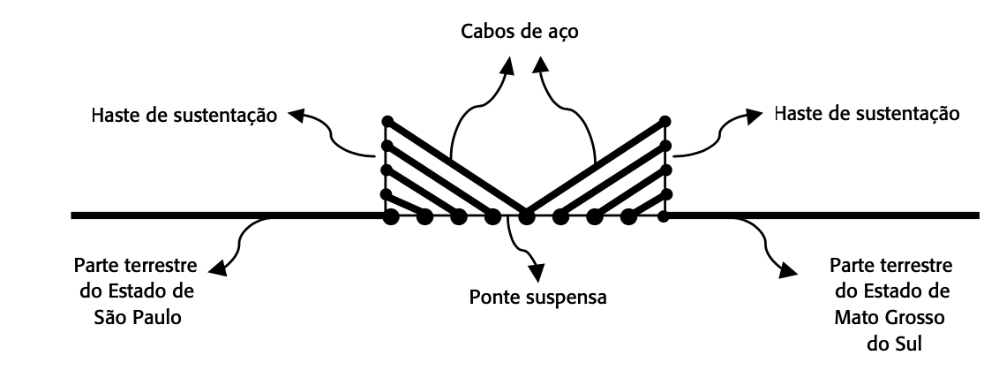

[](https://classroom.github.com/online_ide?assignment_repo_id=7284453&assignment_repo_type=AssignmentRepo)
# Lista de Exercícios


## Identificação
**Professor**: Diego Pinheiro, PhD

**Disciplina**: Programação 2

**Atividade**: Atividade 02 - Vetores

## Instruções 
> 1. Sua implementação deve estar dentro da pasta src/**main**/java 
> 2. Não modifique nenhum código dentro da pasta src/**test**/java).
> 3. A submissão **não deve ser feita após o prazo** (nem 1 minuto a mais)

## Descrição da Atividade

> Crie uma classe `Utils` para implementar os métodos a seguir. 

### Questão 01

Implemente o método 

```java
static int[] buildVectorRepeat(repetitions,value)
```
que recebe um inteiro `repetitions` e um inteiro `value`, e retorna um vetor com o valor do inteiro `value` repetido `repetitions` vezes. 

Exemplo: O código

```java
buildVectorRepeat(3, 1) 
```

retorna o vetor

```java
[1,1,1]
```

### Questão 02
Implemente o método 

```java
static int[] buildVectorSequence(sequenceSize,startValue)
```
que recebe um inteiro `sequenceSize` e retorna um vetor com os `sequenceSize` primeiros inteiros começando do valor `startValue`. 

Exemplo: O código 

```java
buildVectorSequence(3, 1)
```
retorna o vetor 

```java
 [1,2,3]
``` 
   

### Questão 03
Implemente o método 

```java
static int dotProduct(int[] a, int[] b)
```
que recebe dois vetores `a` e `b` e retorna o produto escalar (ie., dot product) entre eles. 

Se

$
\mathbf{a} = (a_1, a_2, ..., a_n) \text{ e}\\
\mathbf{b} = (b_1, b_2, ..., b_n) 
$ 

então o produto escalar $\mathbf{a} \cdot \mathbf{b}$ é 

$
\mathbf{a} \cdot \mathbf{b} = \sum_i^n a_i b_i = a_1 b_1 + a_2 b_2 + ... a_n b_n
$ .

### Questão 04
Um palíndromo é uma sequência que tem a propriedade de poder ser lida tanto da 
1. esquerda para a direita; quanto 
2. da direita para a esquerda. 

Implemente o método 
```java 
`static` boolean `isPalindrome(int[] aSequence)
```
que recebe um vector de inteiros `aSequence` e retorna

- `true`, caso o vetor contenha um palíndromo; ou
- `false` caso contrário. 

Por exemplo, 

```java
isPalindrome([2, 5, 5, 2])
```
retorna `true` e 

 ```java
isPalindrome([1, 5, 4, 1 ])
```
retorna `false`. 

### Questão 05

Segundo o dicionário, a palavra PONTE é definida na ARQUITETURA como uma construção sólida em betão, aço ou madeira, destinada a estabelecer comunicação entre dois pontos separados por um curso de água ou por uma depressão de terreno. 

A atual presidente da República vai beneficiar alguns estados do BRASIL com a construção de obras de grande magnitude e nosso estado será agraciado com uma ponte suspensa que será considerada um marco na construção civil, que ligará o estado de Mato Grosso do Sul ao estado de São Paulo. 

Veja a foto a seguir com um exemplo de ponte suspensa já existente em Porto Alegre (RS) e que se difere da obra a ser construída, pois na ponte ilustrada, o material usado na sustentação foi uma corda especial, e isso impossibilita a passagem de veículos pesados. Assim, como o tráfego previsto para a ponte a ser cons- truída envolve todo tipo de veículo, serão utilizados cabos de aço importados da ALEMANHA. A seguir, apresentamos o projeto da ponte a ser construída. 



Implemente o método 

```java 
static double calculateCableBridge(double bridgeLenght, int numSteelCables)
```
 para calcular quantos metros de cabos de aço serão necessários para construir a ponte suspensa dado o comprimento da ponte `bridgeLenght` e o número de cabos de aço em cada haste `numSteelCables`. 
 
 > Para modularizar seu código, considere crar o método
 
```java 
double[] calculateCablesSupportRod(int numSteelCables, double supportRodHeight, double halfBridgeLenght)
``` 
que recebe o número de cabos de aço `numSteelCables`, a altura da haste `maxCableHeight`, e o comprimento da metade da ponte `halfBridgeLenght`, e retorna um vetor com tamanho `numSteelCables` contendo o comprimento dos cabos de aço em cada haste. 

1. O comprimento da ponte suspensa será fornecido pelo usuário em quilômetros e deve estar entre 2 e 4. 
2. Sabe-se que a ponte terá quatro hastes de sustentação, duas na parte terrestre do estado de Mato Grosso do Sul e outras duas na parte terrestre do estado de São Paulo, e estas ficam nas margens direita e esquerda. 
3. Tem-se, ainda, que a altura da haste, e onde deve ser fixado o cabo de aço mais alto, deve ser de 1/20 da extensão da ponte. 
4. O cabo de aço mais alto será fixado obrigatoriamente no meio da ponte.
5. Cada haste, num total de quatro, sustentará cinco cabos de aço equidistantes. 